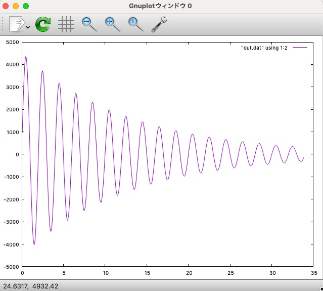

# RLC-parallel

This code solves the parallel RLC circuit using [GSL](https://www.gnu.org/software/gsl/) for differential equation solver. The system parameters are L=47mH, C=47 nF, Is=5 A, and R=20 kohm. See the [MIT OpenCourseWare text](https://ocw.mit.edu/courses/6-071j-introduction-to-electronics-signals-and-measurement-spring-2006/a929d33896839a7bf1ca2631cd87e711_16_transint_rlc2.pdf) for more details.

Use the following command to compile.
```bash {.copy}
  gcc rlc-parallel.c -o rlc-parallel -lgsl -lgslcblas -lm
  ```

